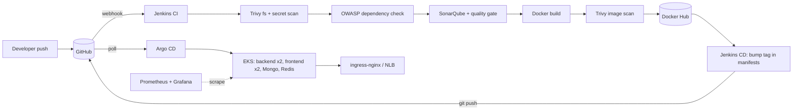

# DevSecOps + GitOps delivery pipeline on AWS EKS

Infrastructure as code, a security-gated CI pipeline, and GitOps continuous delivery for a three-tier Node/React/MongoDB application — built end to end on AWS.

> **What's mine and what isn't.** The application being deployed is [Wanderlust](https://github.com/krishnaacharyaa/wanderlust), an open-source MERN travel blog (MIT). I chose it because it has a real frontend, API, database and cache, which is enough surface to make the pipeline decisions non-trivial. Everything outside `backend/src` and `frontend/src` — the Terraform, both Jenkins pipelines, the Dockerfiles, the Kubernetes manifests, the Argo CD and monitoring setup — is my work.

## Architecture



Two Jenkins jobs, one contract between them: CI produces an immutable image tag (`<build>-<gitsha>`), CD writes that tag into `kubernetes/*.yaml` and pushes. Nothing deploys to the cluster except Argo CD, and Argo CD only reads git. That means the cluster state is always inspectable from the repo history, and a rollback is `git revert`.

## What the pipeline enforces

| Stage | Tool | Fails the build when |
|---|---|---|
| Filesystem scan | Trivy | never (report only) — vulns, secrets, misconfig |
| Dependency check | OWASP DC | never (report published to Jenkins) |
| Static analysis | SonarQube | quality gate fails |
| Image scan | Trivy | any **CRITICAL** with a fix available |
| Build | Docker multi-stage | unit tests fail |

The thresholds are deliberate: filesystem findings on a Node project are noisy, so they're surfaced rather than blocking; a fixable critical CVE in the image you're about to ship is a hard stop.

## Repository layout

```
terraform/      VPC (2 AZ, private nodes, single NAT), EKS 1.30 + managed node group,
                EBS CSI via IRSA, Jenkins host with SSH/UI locked to one CIDR, IMDSv2 only
Jenkinsfile     CI: scan -> analyse -> build -> scan -> push -> trigger CD
GitOps/         CD: update manifests, commit, push, notify
kubernetes/     Namespace, ConfigMap, Secret template, Mongo StatefulSet (EBS-backed),
                Redis, backend/frontend Deployments with probes + resource limits, Ingress
argocd/         Argo CD Application (automated sync, prune, self-heal)
monitoring/     kube-prometheus-stack values
bootstrap/      One script: ingress-nginx, Argo CD, monitoring, register the app
backend/ frontend/   Application code (upstream) + my Dockerfiles
```

## Running it

Prerequisites: AWS CLI, Terraform >= 1.5, kubectl, helm, an existing EC2 key pair.

```bash
# 1. Infrastructure (~15 min)
cd terraform
cp terraform.tfvars.example terraform.tfvars   # set ssh_key_name and allowed_cidr
terraform init && terraform apply

# 2. Cluster add-ons and Argo CD
../bootstrap/install.sh

# 3. Runtime secret (never committed)
kubectl -n wanderlust create secret generic wanderlust-secrets \
  --from-literal=JWT_SECRET="$(openssl rand -hex 64)"

# 4. Jenkins: open the URL from terraform output, add credentials
#    dockerhub-cred, github-cred, sonarqube token; create jobs wanderlust-ci and
#    wanderlust-cd from the two Jenkinsfiles. Point a DNS record at the NLB hostname
#    printed by the bootstrap script (or edit the host in kubernetes/ingress.yaml).
```

Local development without the cluster:

```bash
cp backend/.env.sample backend/.env   # fill in, including a JWT_SECRET
docker compose up --build             # frontend on :5173, API on :8080
```

## Decisions and trade-offs

- **Jenkins over GitHub Actions.** I wanted the CI server itself to be part of what Terraform provisions, and the OWASP/SonarQube plugin ecosystem is mature on Jenkins. On a client project I'd default to GitHub Actions for a repo that already lives on GitHub.
- **Image tag = build number + git SHA.** Tags are never typed by hand and never reused, so `kubectl describe` on a pod tells you exactly which commit is running.
- **Argo CD polls git; Jenkins never runs `kubectl apply`.** One less credential with cluster access, and every deployment is a commit.
- **Mongo on EBS via StatefulSet.** Correct for a lab; on a real project this is a managed database (DocumentDB or Atlas) and the StatefulSet disappears.
- **Single NAT gateway.** Saves ~$32/month. Production gets one per AZ.
- **Config in a ConfigMap, the JWT secret in a Secret created out-of-band.** The upstream project ships secrets in a `.env` file; that file is gone from this repo and `.gitignore` keeps it out.

## What I'd change before calling this production

- Replace Docker Hub with ECR and pull through an IRSA-scoped role.
- Move the ingress to the AWS Load Balancer Controller with ACM TLS.
- External Secrets Operator backed by AWS Secrets Manager instead of a manually created Secret.
- Add a staging namespace and an Argo CD ApplicationSet so a PR merge to `main` deploys to staging and a tag deploys to production.
- Alertmanager routes to something a human reads.

---

**Hammad Khalid** — DevOps Engineer · [GitHub](https://github.com/hammad558) · [LinkedIn](https://linkedin.com/in/hammad-khalid99)
